# AssetFlow - IT Asset Management System

A web-based system for tracking IT equipment, managing checkouts, and scheduling maintenance. Built with ASP.NET Core MVC as part of my journey learning full-stack development.

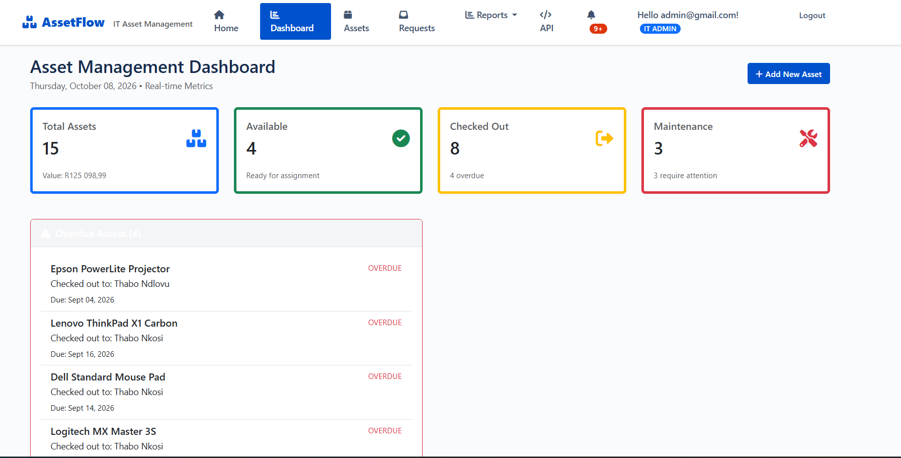


## Why I Built This

At my current workplace, I saw how much time gets wasted tracking equipment manually - who has what laptop, when was the last printer maintenance, which projector is available for the conference room. I thought, "there has to be a better way to do this," so I built one.

This project helped me learn ASP.NET Core while solving a real problem. Every feature here came from thinking about actual IT department workflows.

## What It Does

### Current Features

**Asset Management**
- Add new equipment with details (serial number, category, purchase info, warranty dates)
- Track location and status of all assets
- Prevents duplicate serial numbers
- Categories include IT Equipment, Furniture, AV Equipment, Office Supplies

**Check-In/Check-Out System**
- Admin checks out assets to employees
- Tracks who has what, from which department
- Shows expected return dates with overdue indicators (the red "17 days overdue" warning you see in screenshots)
- Admin marks condition when equipment comes back
- Flags items that need maintenance during return

**Maintenance Tracking**
- Schedule maintenance with due dates
- Color-coded urgency (red = overdue, coming soon: yellow for due soon)
- Track maintenance history and notes
- Quick toggle between maintenance and available status

**Dashboard & Reports**
- Real-time metrics (total assets, available count, checked out, needing maintenance)
- Asset value by category with interactive pie chart visualization
- Summary table showing count and total value per category
- Export to CSV for external analysis
- Print-friendly report generation
- Checkout history with date ranges
- Maintenance schedule showing overdue items

**Roles and the Request Workflow**
- Two roles: Admin (IT department) and Employee
- Employees sign up with their name and department, and land on their own portal
- Employees browse what is available, submit a request with dates and a reason, and can cancel while it is still pending
- Admin gets a request queue with a live count in the navigation, oldest first
- Approving a request checks the asset out to the requester in one step
- Rejections need a reason, and the requester sees it on their request list
- Employees can see exactly what is signed out to them and when it is due back
- Inventory, reports, maintenance and the dashboard are admin-only

**Notifications**
- A bell in the nav with an unread count, for both roles
- Admin gets told when a request comes in or gets withdrawn
- The employee gets told when their request is approved or declined, and the
  rejection reason comes with it
- Overdue equipment and items due for a service show up on their own
- Clicking a notification marks it read and takes you straight to whatever it's about
- Mark all read, or clear the ones you've read (unread ones stay put, so you can't
  accidentally lose something you haven't looked at)

**Bulk Import**
- Load a whole spreadsheet of assets at once, with a template you can download
- Leave "check the file without importing" ticked and it just tells you what would
  happen - nothing gets written
- A bad row gets skipped with a reason and a line number that matches Excel, and
  the rest still import. Importing 200 assets shouldn't cost you 199 because of one typo
- Catches duplicate serials against the database and inside the file itself
- Reads prices either way round, so R 4 250,00 and 4,250.00 both come out as 4250

**Search and Filtering**
- Search covers name, serial, location, vendor and whoever's holding the thing
- Filter by status, category, vendor, department and a price range
- One-click views for overdue, maintenance due, expired warranty and missing location
- Sort by name, price or purchase date
- The category and vendor dropdowns come off the data now instead of being hardcoded

**Recurring Maintenance**
- Set how often something gets serviced and it goes on a schedule
- Finishing a service books the next one, so nobody has to remember to type a date
  in every time
- The asset page shows the schedule, when it was last done and how late the next
  one is running
- Clearing the interval takes it off the schedule and cancels what was booked
- Anything due or overdue feeds the notification bell

**On a phone**
- The inventory drops its less important columns as the screen narrows instead of
  making you scroll sideways to reach the buttons - the serial moves up under the name
- The filter panel folds away behind a button, and opens itself if a filter is on
- Buttons are big enough to actually hit, and the page actions stack instead of
  squashing up next to the heading

**Analytics**
- Every checkout is kept now, so a returned item stays on the record instead of
  disappearing the moment it comes back
- Usage report: how often each asset goes out, days out, utilisation and idle time,
  with most-used, least-used and longest-idle views
- Checkout trends by month, on a chart
- Department allocation - what each one is holding now versus what it borrows overall
- Straight-line depreciation with book value, plus what each day of use has cost
- Report builder for picking your own columns and filters, with CSV export
- The reports tell you how long they've been recording, so a new system doesn't get
  mistaken for a quiet one

**API Access**
- RESTful endpoints for all major operations
- Swagger/OpenAPI documentation for testing
- Search and filter capabilities
- JSON responses for potential integrations

## Screenshots

### Requesting equipment

An employee sees only what is available and what they have asked for. Everything
else in the system is admin-only.

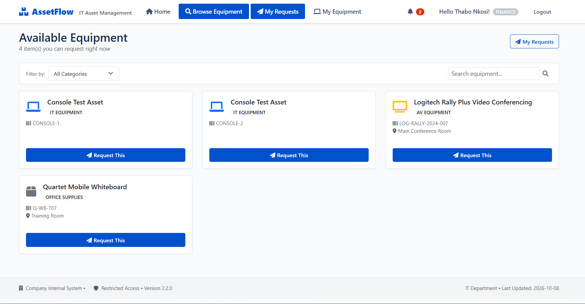

*Browse what is available.*

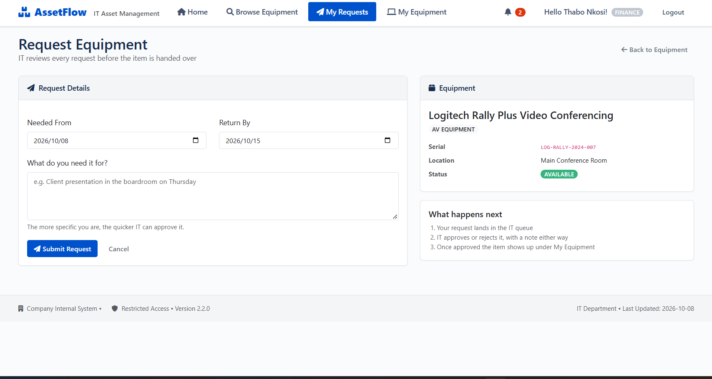

*Ask for it, with the dates it is needed and a reason.*

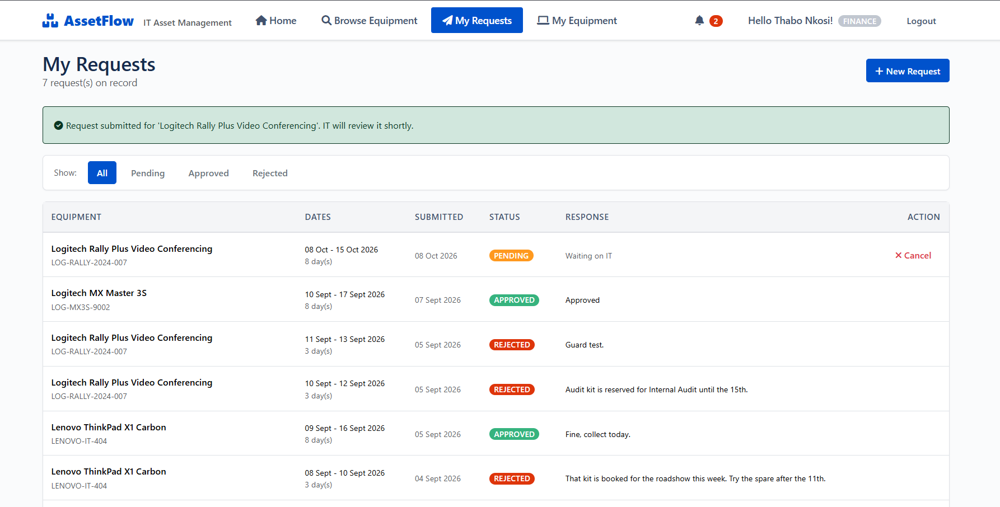

*Follow it. A rejection carries the reason it was turned down, and a pending
request can still be cancelled.*

### Deciding on it

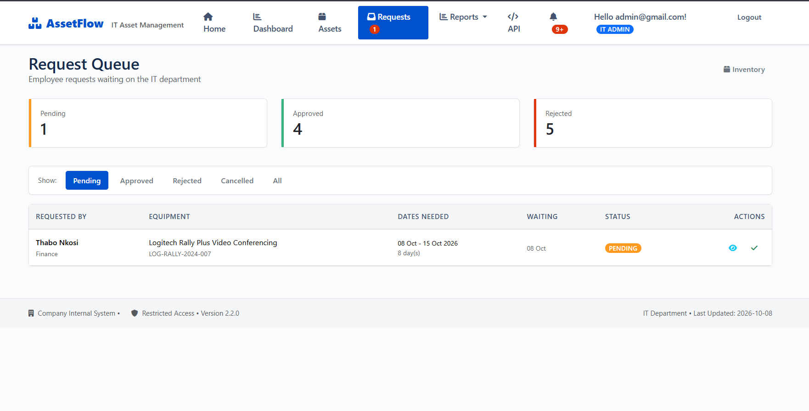

*The admin queue, oldest first, with a live count in the navigation.*

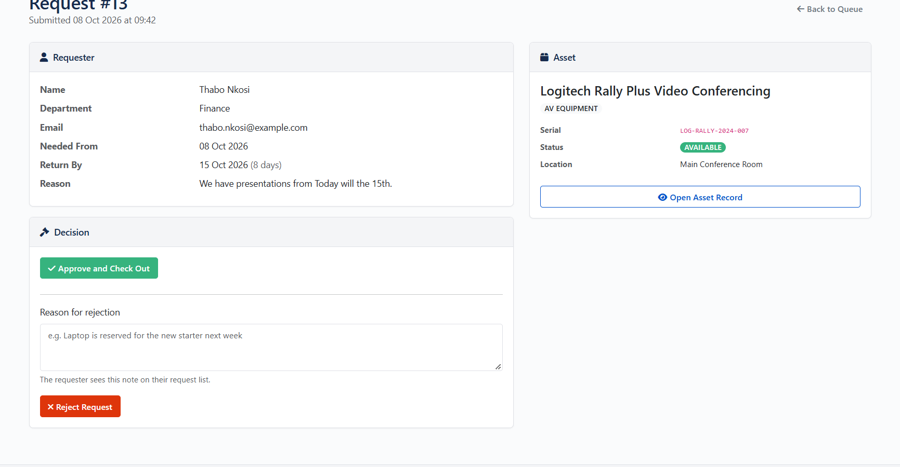

*Approving checks the asset out to the requester in one step, so the queue and
the inventory cannot disagree.*

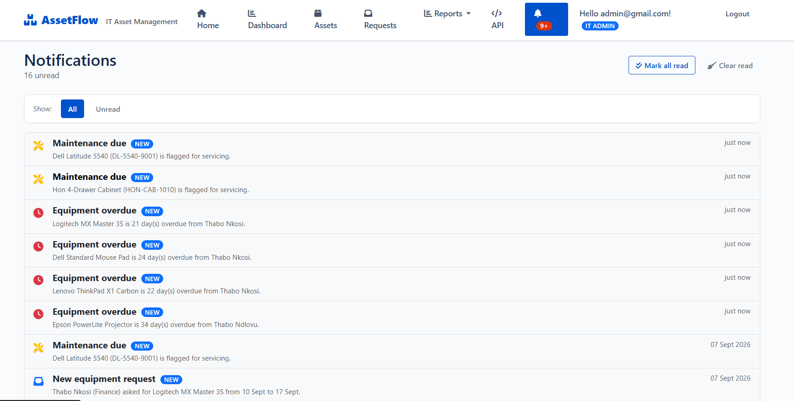

*Both sides get told. Clicking a notification marks it read and opens whatever
it refers to.*

### Running the register

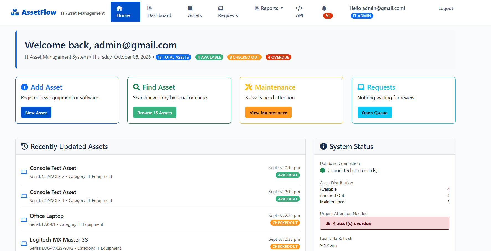

*Home, with the actions an admin reaches for most.*


*Live counts, asset value by category and checkout trends, with CSV export.*

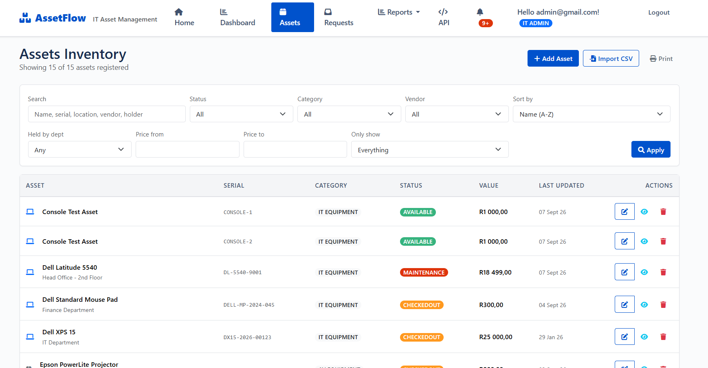

*The inventory: what is owned, where it is and what state it is in.*

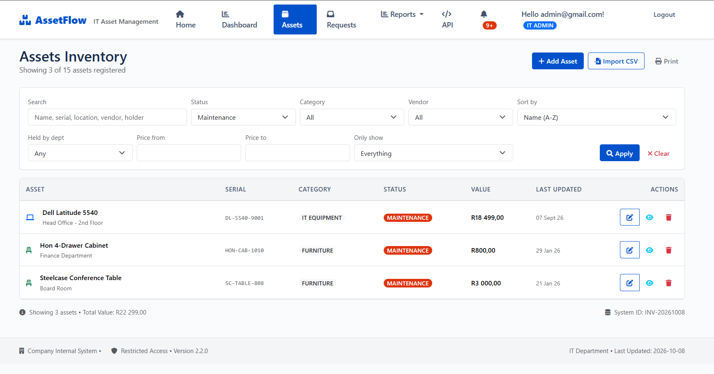

*Maintenance, colour-coded by urgency. Anything overdue feeds the notification
bell.*

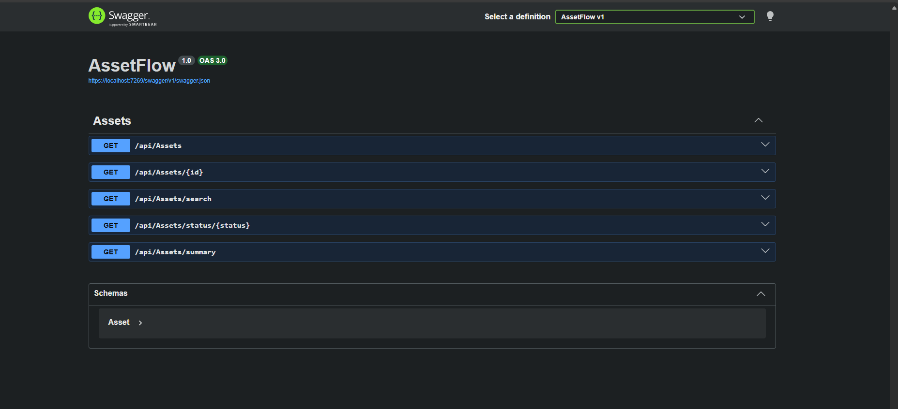

*The REST API, documented with Swagger so another system can read the register.*


## Tech Stack

- **Backend:** ASP.NET Core 10.0, C#
- **Database:** SQL Server (SQLite for dev/testing)
- **ORM:** Entity Framework Core
- **Auth:** ASP.NET Core Identity
- **Frontend:** Razor Pages, Bootstrap 5, custom CSS
- **Charts:** Chart.js for data visualization
- **API Docs:** Swashbuckle/Swagger

## Getting Started

### Prerequisites
- .NET 10.0 SDK
- SQL Server (or use SQLite for quick testing)
- Visual Studio 2022 or VS Code

### Installation

1. Clone the repo
```bash
git clone https://github.com/MoroesiR/assetflow.git
cd assetflow
```

2. Update the database
```bash
dotnet ef database update
```

3. Run the application
```bash
dotnet run
```
Or just hit F5 in Visual Studio

4. Open your browser to `https://localhost:5001`

### Setting up the admin account
The admin account is created on first run, but the password is **not** in this
repository - a committed password is a committed password, even a throwaway one.
Set it in user secrets before the first run:

```bash
dotnet user-secrets set "AdminUser:Password" "your-password-here"
```

The email and display name come from the `AdminUser` section of
`appsettings.json` and can be changed there. If no password is set the seeder
creates the roles and skips the account, so nothing breaks - you just will not
have an admin to sign in with until you set one.

For the employee side, register a new account through the Register link. Anyone
who signs up gets the Employee role; admin rights only come from the seeder or
by hand.


## Current Limitations & Known Issues

The admin still does all the physical work - handing equipment over, checking it
back in, scheduling maintenance. Employees can now ask for equipment themselves
instead of walking to the IT office, but nothing is self-service beyond that.

**Known limitations:**
- Notifications only live in the app. There's no mail or SMS gateway behind this, so nothing reaches you while you're signed out
- The overdue and maintenance check runs when somebody opens the bell rather than on a timer, so you see a notice on your first visit instead of overnight
- Approving one request doesn't auto-reject the others waiting on the same asset. The admin gets warned and decides - I'd rather it asked than guessed
- A request carries the dates you need something for, but approving it hands the item over right then instead of holding it until the start date. Works fine in practice, the request queue is the booking system
- The next service gets booked when you mark the previous one done, so if nobody ever marks an asset available again the schedule won't roll on by itself
- The analytics only know about checkouts since I added the checkout records. Check-in used to wipe the holder and the checkout date off the asset, so anything returned before that is gone. "Never checked out" really means "not since I started keeping track"
- Depreciation gets its useful life from the category, not the asset. Nothing has ever asked for one per item and I figured that field would just sit empty

## Future Features

All three phases are done and written up under Current Features. Two things I
want to be straight about:

**Email notifications** were on the Phase 2 list and I built them in-app instead.
I don't have a mail gateway, and I didn't want the project quietly depending on
somebody's free tier staying free. Wiring up delivery later is a swap-in - the
notifications and the trigger points are already there.

**The reservation system** came off the list. A request already carries the dates
you need something for and the admin approves it, so a separate booking feature
would have been the request queue again with a different name on it.

### What I'd do next
- Lock down or drop the remaining API surface as it grows - the assets endpoints
  are admin-only now, anything I add needs the same
- A nightly job for the overdue and maintenance check so notices land overnight
  instead of when somebody opens the bell
- Let the admin set a useful life on an asset where the category default is wrong.
  A R35 000 laptop and a R200 mouse pad are both "IT Equipment" right now
- More tests. 49 is a start, not a suite - the controllers have none

## What I Learned Building This

**Technical stuff:**
- Entity Framework relationships are trickier than they look - spent a whole afternoon figuring out why my cascade deletes weren't working
- ASP.NET Identity is powerful but the documentation assumes you know more than you do
- State management for the asset lifecycle (Available → Checked Out → Maintenance → Available) needed more thought than I expected
- Swagger is amazing for API testing - wish I'd set it up earlier
- Bootstrap is great until you need something custom, then you're writing CSS anyway
- Swapping IdentityUser for my own ApplicationUser halfway through the project meant touching the context, the seeder and every page that injected the old type. Next time I'll extend the user on day one
- Hiding a nav link is not security. The role checks had to go on the controllers, and I only trusted them once I'd tried typing the admin URLs in as an employee
- Deleting data is easy to do by accident. Check-in was setting the holder and the checkout date back to null, which felt tidy at the time and meant I had no history at all when I came to build the usage reports. Wish I'd kept a record from the start
- Don't split a CSV on commas. My first import worked until a description had a comma in it, and then every column after it shifted one across
- Numbers aren't the same everywhere. "R 4 250,00" and "4,250.00" are the same money, and my first parser turned the first one into 425 000 because it stripped every comma it saw
- Writing a report is easy, making it honest is harder. My usage report was quietly claiming months of history off dates it had carried over from old records, when it had actually been running about an hour

**Design decisions:**
- Started with too many features in mind, had to scale back to get something working first
- User workflows are harder to design than the actual code
- Validation is boring but absolutely necessary (learned this when test data broke everything)
- Color coding makes a huge difference in usability

**Challenges I overcame:**
- Figuring out how to prevent duplicate serial numbers while still allowing edits
- Making the checkout history show actual return status (not just dates)
- Getting the maintenance "days overdue" calculation to work properly
- Chart.js integration took longer than expected (JavaScript + Razor Pages = confusion at first)
- Deployment readiness - had to refactor connection strings and configurations
- Two people can request the same laptop, and the admin can also check it out by hand while a request sits in the queue. Availability now gets re-checked at the moment of approval instead of when the request was made
- Stopping the same request landing twice - a double click on submit was enough to do it before I added the pending-request check
- Getting a recurring schedule to actually recur. The due date was a single field somebody had to retype after every service, so of course it never repeated. Completing the service is what books the next one now
- Squeezing a seven-column table onto a phone. Dropping columns by priority worked better than letting the whole row scroll sideways, because the buttons were the thing you couldn't reach
- Working out that a build failure wasn't my code at all - Windows Smart App Control had switched itself on mid-session and was blocking the compiled DLL from loading

## Project Structure

```
AssetFlow/
├── Areas/Identity/      # Login and registration pages
├── Controllers/         # MVC controllers
│   └── Api/             # JSON endpoints (admin only)
├── Models/              # Entity models and ViewModels
├── Views/               # Razor views for UI
├── ViewComponents/      # Small reusable pieces (the pending request and bell badges)
├── Services/            # The logic that got too big for a controller - CSV reading,
│                        # imports, notifications, the checkout ledger, analytics
├── Data/                # Database context and seeding
├── Migrations/          # EF migrations
├── AssetFlow.Tests/     # xUnit tests
├── wwwroot/             # Static files (CSS, JS, images)
└── appsettings.json     # Configuration (no secrets - see the setup section)
```

Anything with real logic in it moved out to `Services/` as I went. The controllers
were getting long, and it also meant I could test that logic without spinning up a
whole web request.

## Running the Tests

```bash
cd AssetFlow.Tests
dotnet test
```

49 tests, mostly around the CSV import and the report calculations - the two places
I actually got things wrong.

## Why This Project Matters

Beyond just being a portfolio piece, I built this to demonstrate that I can:
- Identify real business problems and design solutions
- Build full-stack applications from database to UI
- Create systems that people would actually want to use
- Write clean, maintainable code
- Think about user experience, not just functionality

This system could legitimately be used by a small-to-medium business IT department today. Now that employees can request equipment themselves it is a lot closer to how an IT department actually works.

## Live Demo

[Coming soon]

## Contact

**Moroesi Ramodupi**
- Email: moroesiramodupi@gmail.com / mavundlamoroesi@gmail.com
- GitHub: [@MoroesiR](https://github.com/MoroesiR)
- Location: Durban, South Africa
- Currently: Junior Software Developer, open to remote opportunities

## License

This project is open source and available under the MIT License.

---

*Built with C# and way too much coffee ☕*
*Current Version: 2.2.0*
